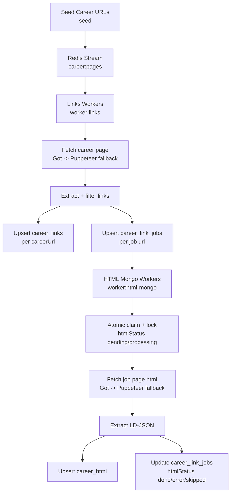

# Career Link Finder Pipeline

This project crawls career pages, extracts candidate job links, and then processes those job links for HTML/LD-JSON in a separate stage.

The pipeline is built for high volume batch runs and multi-server workers.

## What It Does

1. Seed career page URLs from file or Mongo.
2. Crawl each career page and extract links.
3. Filter links and identify likely job links.
4. Persist discovered job links durably in Mongo.
5. Process job links later (recommended) or immediately (optional) to extract job page data.

## High-Level Architecture

- Redis Stream `career:pages`: career page crawl work.
- Redis Stream `career:pages:failed`: parked links-worker failures for replay.
- Redis Stream `career:links`: optional Redis-based HTML work queue.
- Redis Set `career:links:dedupe`: optional queue dedupe set.
- Mongo `career_links`: aggregated links per career URL.
- Mongo `career_link_jobs`: durable per-job-link records and HTML lifecycle state.
- Mongo `career_html`: job page extraction output.

## Recommended Flow (Best For Large Batches)

1. Seed career pages.
2. Run only `worker:links` (many servers).
3. Let links accumulate in `career_link_jobs`.
4. Run `worker:html-mongo` later (many servers).

This avoids data loss from temporary queue state and keeps Mongo as source of truth.

## Flowchart



Additional diagrams are in `docs/PIPELINE_FLOW.md`.

## Commands

- Seed from Mongo:
```bash
npm run seed -- --collection <collection_name> --field careerUrl --batch-size 1000
```

- Seed from file:
```bash
npm run seed -- --file ./urls.txt
```

- Run links workers:
```bash
npm run worker:links
```

- Run HTML workers from Mongo (recommended):
```bash
npm run worker:html:mongo
```

- Run HTML workers from Redis queue:
```bash
npm run worker:html
```

- Check queue + retry health snapshot:
```bash
npm run health
```

- Health snapshot as JSON:
```bash
node pipeline/index.js health --json
```

- Queue Mongo job links into Redis HTML stream (optional path):
```bash
npm run seed:job-links -- --batch-size 2000
```

- Replay failed links-worker jobs from Redis failed stream:
```bash
node pipeline/index.js seed:failed-links --batch-size 2000
```

- Force reseed of pending HTML queue flags:
```bash
npm run seed:job-links -- --reset-queued --batch-size 2000
```

## Quick Start (CLI Style You Are Using)

```bash
cd /home/careerlinkfinderNew/
git pull
npm i
export MONGODB_DATABSAE=careefinder_prod
export IMPORT_COLLECTION=carrerlinks_p1batch
node pipeline/index.js seed
pm2 start pipeline/index.js -i 8 --name worker-links -- worker:links
```

Then run HTML later:

```bash
pm2 start pipeline/index.js -i 8 --name worker-html-mongo -- worker:html-mongo
```

Note: `MONGODB_DATABSAE` spelling is kept as-is to match current config mapping.

## PM2 Examples

- Links workers:
```bash
pm2 start pipeline/index.js -i 8 --name worker-links -- worker:links
```

- HTML workers (Mongo mode, recommended):
```bash
pm2 start pipeline/index.js -i 8 --name worker-html-mongo -- worker:html-mongo
```

- HTML workers (Redis mode):
```bash
pm2 start pipeline/index.js -i 8 --name worker-html -- worker:html
```

## Data Safety Behavior

- Link data is preserved on link-fetch errors by default (`PRESERVE_LINKS_ON_ERROR=true`).
- Final links-worker failures are parked in Redis (`career:pages:failed`) for replay.
- Link arrays can merge across multiple runs (`MERGE_LINKS_ACROSS_RUNS=true`).
- Discovered job links are durably upserted in `career_link_jobs`.
- HTML processing state is tracked in Mongo: `pending`, `processing`, `done`, `skipped`, `error`.
- Mongo HTML worker uses lock fields (`htmlLockBy`, `htmlLockUntil`) to coordinate multiple servers safely.

## Important Runtime Settings

Set these via environment variables (directly read by `pipeline/index.js`):

- `ENQUEUE_HTML_FROM_LINKS_WORKER`: `false` recommended for delayed HTML batch.
- `PRESERVE_LINKS_ON_ERROR`: keep existing links when a crawl fails.
- `MERGE_LINKS_ACROSS_RUNS`: union old + new discovered links.
- `KEEP_EXTERNAL_LIKELY_JOB_LINKS`: keep external links when they match job-link patterns (useful for iframe ATS boards).
- `LINKS_FETCH_MODE`: `auto` (default), `puppeteer`, or `got` for `worker:links`.
- `MIN_LIKELY_JOB_LINKS_FOR_GOT`: in `auto` mode, minimum likely job links required to accept Got result before Puppeteer fallback.
- `REDIS_ENQUEUE_BATCH_SIZE`: Redis enqueue batch size.
- `MONGO_BULK_WRITE_BATCH_SIZE`: Mongo bulk upsert batch size.
- `HTML_MONGO_LOCK_MS`: lock duration for Mongo HTML claim.
- `HTML_MONGO_POLL_MS`: idle poll delay in Mongo HTML worker.
- `HTML_MONGO_RETRY_ERRORS`: allow retry of error-state docs.
- `HTML_MONGO_RETRY_DELAY_MS`: delay before retrying error docs.
- `LINKS_WORKER_CONCURRENCY`: per-process message concurrency for links workers.
- `HTML_WORKER_CONCURRENCY`: per-process message concurrency for Redis HTML workers.
- `SKIP_NON_JOB_LINKS_IN_HTML_WORKERS`: `false` by default; set `true` only if you want pre-filter skip behavior in HTML workers.
- `PUPPETEER_ON_SHORT_HTML`: if `false`, accept non-empty Got HTML without Puppeteer fallback (lower load, faster).
- `STREAM_DELETE_ACKED_MESSAGES`: if `true` (default), remove processed stream entries from Redis after `XACK`.
- `STREAM_RETRY_ON_ERROR`: if `true` (default), requeue transient stream failures.
- `STREAM_MAX_RETRIES`: max Redis stream retries before final error persistence (default `3`).
- `STREAM_NON_RETRYABLE_EXTENSIONS`: comma-separated file extensions that should not be retried (for example `.zip,.pdf,.jpg`).
- `HEALTH_STATS_KEY`: Redis hash key used to store retry counters for health checks.
- `CAREER_PAGES_FAILED_QUEUE`: Redis stream key used for parked links-worker failures.

## Mongo Collections and Meaning

- `career_links`: one document per `careerUrl`, stores discovered links and job links.
- `career_link_jobs`: one document per job `url`, tracks discovery metadata and HTML processing lifecycle.
- `career_html`: one document per job `url`, stores parsed output for job pages.

`career_links` status fields:
- `jobLinksStatus`: `job_links_found` | `no_job_links` | `error`
- `crawlStatus`: `success` | `error`

Quick query for pages with no job links:
```js
db.career_links.find({ jobLinksStatus: "no_job_links", crawlStatus: "success" })
```

## Optional Redis HTML Mode Notes

Redis HTML queue mode is supported, but for very large delayed runs Mongo HTML mode is safer because job state is durable in Mongo.

If you use `seed:job-links`, default is `--use-dedupe false` so old Redis dedupe keys do not accidentally suppress queueing.

## Throughput Notes For 2M+ Batch

1. Use multiple workers on multiple servers for `worker:links`.
2. Keep `ENQUEUE_HTML_FROM_LINKS_WORKER=false` during link collection.
3. Run `worker:html-mongo` as a separate stage.
4. Tune `REDIS_ENQUEUE_BATCH_SIZE` and `MONGO_BULK_WRITE_BATCH_SIZE`.
5. Keep Mongo indexes healthy (`career_link_jobs.url`, `career_html.url`, `career_links.careerUrl`).
6. For Redis HTML workers, start with `HTML_WORKER_CONCURRENCY=1` and increase gradually only if CPU/RAM allow.

## Troubleshooting

- No records seeded: check `--collection`, `--field`, and mark fields (`redisSeeded`, `redisSeededAt`).
- HTML workers idle in mongo mode: check `career_link_jobs.htmlStatus` values and lock timestamps.
- Redis HTML workers not receiving jobs: ensure `seed:job-links` has run (or set `ENQUEUE_HTML_FROM_LINKS_WORKER=true`).
