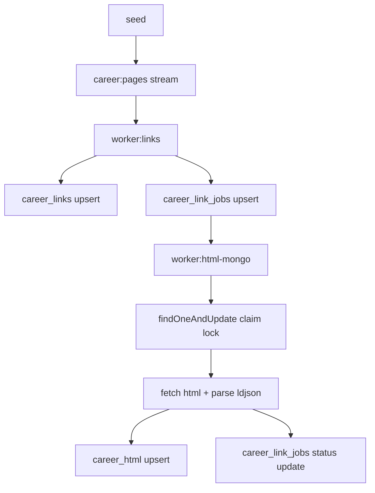
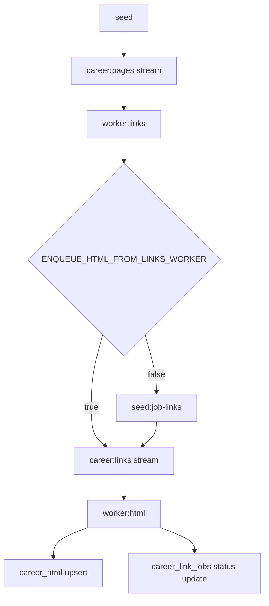
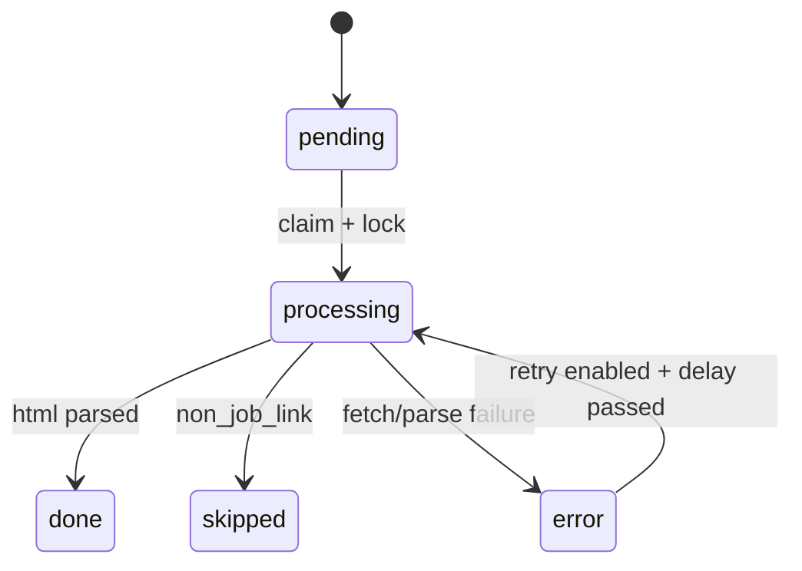

# Pipeline Flow Charts

## 1) Recommended Two-Stage Flow (Mongo Durable HTML)

```mermaid
flowchart TD
    A[seed] --> B[career:pages stream]
    B --> C[worker:links]
    C --> D[career_links upsert]
    C --> E[career_link_jobs upsert]
    E --> F[worker:html-mongo]
    F --> G[findOneAndUpdate claim lock]
    G --> H[fetch html + parse ldjson]
    H --> I[career_html upsert]
    H --> J[career_link_jobs status update]
```

## 2) Optional Redis Queue HTML Flow

```mermaid
flowchart TD
    A[seed] --> B[career:pages stream]
    B --> C[worker:links]
    C --> D{ENQUEUE_HTML_FROM_LINKS_WORKER}
    D -->|true| E[career:links stream]
    D -->|false| F[seed:job-links]
    F --> E
    E --> G[worker:html]
    G --> H[career_html upsert]
    G --> I[career_link_jobs status update]
```

## 3) Mongo HTML Job State Machine

```mermaid
stateDiagram-v2
    [*] --> pending
    pending --> processing: claim + lock
    processing --> done: html parsed
    processing --> skipped: non_job_link
    processing --> error: fetch/parse failure
    error --> processing: retry enabled + delay passed
```

